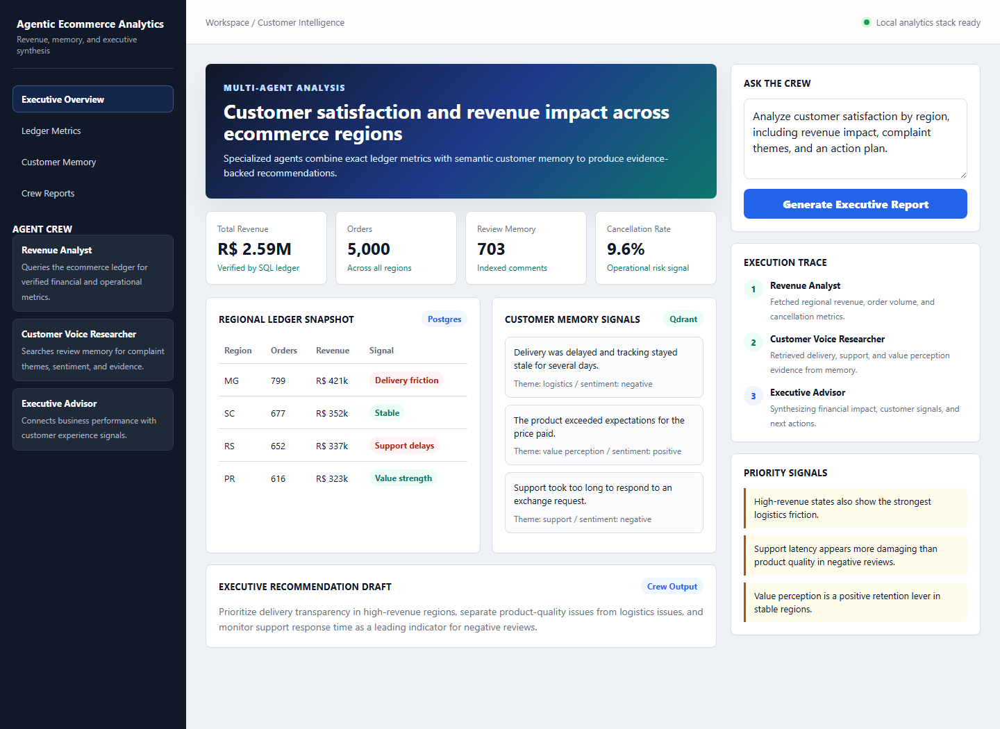

# Agentic Ecommerce Analytics

An AI data engineering project that combines structured analytics, vector search, and an autonomous agent interface for ecommerce questions.



The system uses two complementary data stores:

- **Ledger:** Postgres for exact business metrics such as revenue, orders, products, payment methods, and customer segments.
- **Memory:** Qdrant for semantic search over customer reviews, complaints, sentiment, and recurring experience themes.

I built this as a portfolio version of a practical study project. The public repository keeps my implementation, notes, and technical decisions.

## What It Does

- Generates synthetic ecommerce data with ShadowTraffic.
- Stores customers, products, and orders in Postgres.
- Writes customer reviews as JSONL files.
- Validates ecommerce entities with Pydantic models.
- Runs business queries against the relational store.
- Embeds review comments with FastEmbed and indexes them in Qdrant.
- Exposes two LangChain tools: one for SQL analytics and one for semantic review search.
- Uses a ShopAgent to route questions to the right tool.
- Adds a CrewAI workflow with separate revenue analysis, customer voice research, and executive synthesis roles.
- Includes routing evaluation cases for SQL-only, semantic-only, and hybrid questions.
- Provides a Chainlit chat interface for interactive exploration.

## Architecture

```text
Synthetic data
ShadowTraffic
    |
    +--> Postgres ------------------+
    |    "The Ledger"               |
    |    exact metrics              |
    |                               v
    +--> JSONL reviews --> Qdrant --> ShopAgent / CrewAI --> Chainlit
                         "Memory"          |
                         semantic          v
                         search       answers and reports
```

## Project Structure

```text
infra/
  docker-compose.yml        Local Postgres, Qdrant, and ShadowTraffic
  init.sql                  Ecommerce relational schema
  shadowtraffic.json        Synthetic data generation config
  license.env.example       ShadowTraffic license template

src/
  domain/                   Pydantic domain models and validation demo
  analysis/                 Structured LLM analysis and SQL business queries
  retrieval/                Review ingestion and semantic search
  agent/                    LangChain tools and ShopAgent factory
  crew/                     CrewAI multi-agent report workflow
  evaluation/               Routing evaluation cases and DeepEval runner
  demos/                    Architecture comparison scripts
  app/                      Chainlit interface

frontend/
  index.html                Static dashboard mockup

docs/
  architecture.md           System design and data flow
  learning-notes.md         Personal implementation notes
  multi-agent-design.md     Crew design and evaluation notes
```

## Setup

Create a virtual environment and install dependencies:

```bash
python -m venv .venv
.venv\Scripts\activate
pip install -r requirements.txt
```

Create local environment files:

```bash
copy .env.example .env
copy infra\license.env.example infra\license.env
```

Fill in:

- `ANTHROPIC_API_KEY` in `.env`
- ShadowTraffic license fields in `infra/license.env`

Start local services and generate data:

```bash
cd infra
docker compose up
```

The generated reviews are written to `infra/data/reviews/`. This directory is ignored by Git.

## Common Commands

From the project root:

```bash
python src/domain/validation_demo.py
python src/analysis/ledger_queries.py
python src/retrieval/ingest_reviews.py
python src/retrieval/semantic_search.py
python src/agent/shopagent.py
python src/crew/ecommerce_intelligence_crew.py
python src/demos/compare_single_agent_vs_crew.py
python -m pytest tests
chainlit run src/app/chainlit_app.py --port 8000
```

Run optional DeepEval routing checks:

```bash
python src/evaluation/deepeval_routing.py
```

If Docker Compose creates a different Postgres container name, override it:

```bash
set SHOPAGENT_POSTGRES_CONTAINER=infra-postgres-1
```
